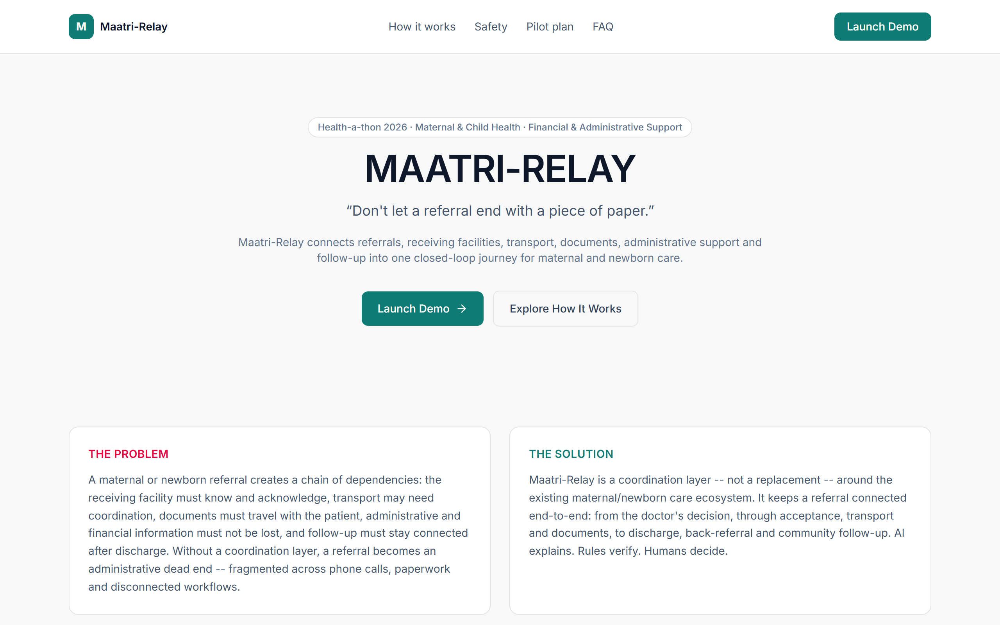
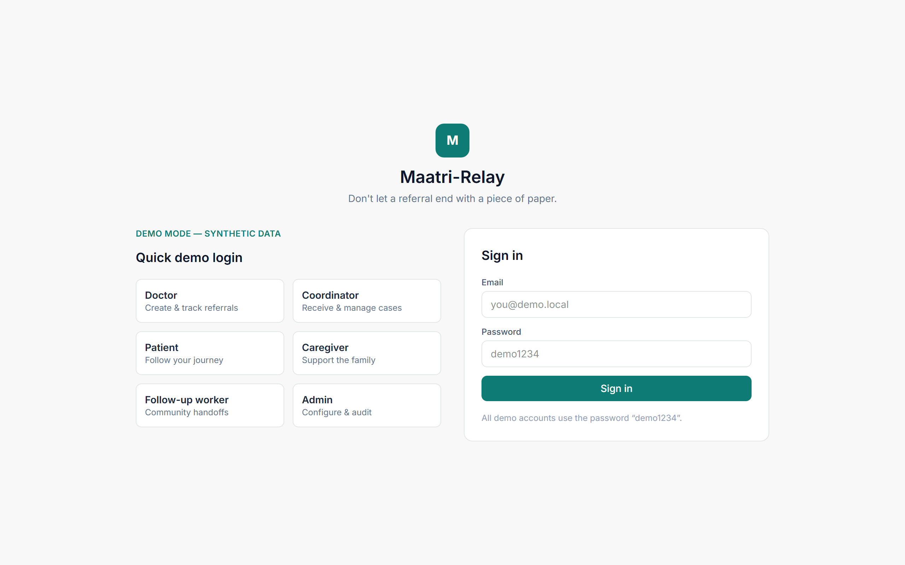
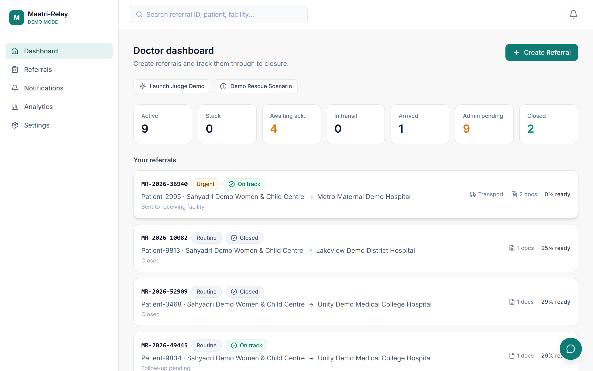
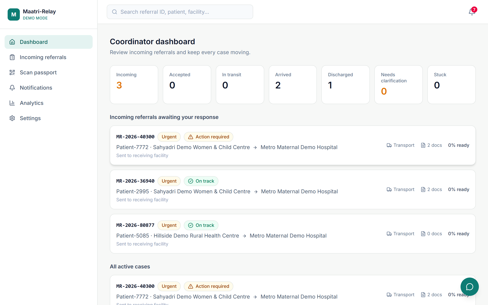
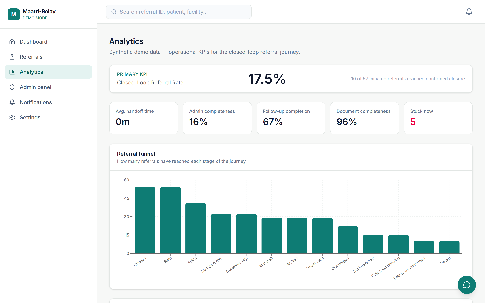

# SafeJourney (सुरक्षित यात्रा)

<div align="center">



### **Closed-Loop Maternal & Newborn Referral + Administrative Continuity Platform**
*Coordinating referrals, handoffs, discharge transitions, back-referrals, and follow-up workflows while keeping clinical decisions with qualified healthcare professionals.*

[](https://nextjs.org/)
[](https://www.typescriptlang.org/)
[](https://tailwindcss.com/)
[](https://www.prisma.io/)
[](https://vitest.dev/)
[](https://playwright.dev/)
[](https://www.docker.com/)
[](LICENSE)

> *"Don't let a maternal referral end with a piece of paper."*

</div>

---

## 1. Project Title & Tagline

**SafeJourney** — *Don't let a maternal or newborn referral end with a piece of paper.*

---

## 2. Project Overview

**SafeJourney** is a maternal and newborn referral-coordination platform that helps healthcare teams coordinate referrals, handoffs, discharge transitions, back-referrals, and follow-up workflows while keeping clinical decisions with qualified healthcare professionals.

It acts as an assistive, **non-clinical digital coordination layer** connecting the entire continuum of maternal care: from the referring physician's initial transfer decision, through receiving facility acknowledgment, emergency transport logistics, document digitization, scheme entitlement discovery (JSSK, PMMVY, PM-JAY), to inpatient arrival, discharge summary generation, back-referral acknowledgment, and structured community health worker (ASHA/ANM) follow-up.

---

## 3. Problem Statement

Across high-burden maternal care corridors, thousands of high-risk obstetric and neonatal emergencies are referred from Primary Health Centers (PHCs) and Community Health Centers (CHCs) to tertiary district hospitals and medical colleges every year.

Tragically, many referrals become administrative dead ends due to systemic coordination gaps:
1. **Unacknowledged Handoffs**: Patients arrive at receiving hospitals without advance notification or prior acknowledgment.
2. **Lost Paperwork & Identity Friction**: Physical referral slips and diagnostic reports get damaged, lost in transit, or overlooked during emergency intake.
3. **Delayed or Uncoordinated Transport**: Families struggle to arrange emergency ambulances without central tracking.
4. **Missed Social Welfare Entitlements**: Under time pressure, eligible families miss out on government cash transfers and free transport/diagnostics (JSSK, PMMVY, PM-JAY).
5. **Disconnected Post-Discharge Care**: Once discharged, patients return home with no structured back-referral to their local primary clinic or ASHA worker, leading to preventable postpartum complications.

---

## 4. Our Solution

SafeJourney solves the **operational and administrative coordination problem** through a unified digital platform built around our core operating principle:

> **"AI explains. Rules verify. Humans decide."**

* **Closed-Loop Referral Lifecycle**: Every referral follows a strict, deterministic state machine with verifiable handoffs.
* **Opaque QR Referral Passport**: A lightweight, offline-printable QR code acting as a secure lookup token (no patient data embedded in the QR token itself).
* **Referral Rescue Engine**: Autonomous SLA monitoring that flags unacknowledged referrals as `STUCK` and prompts immediate operational rerouting.
* **Deterministic Benefit Radar**: Pure rule-engine matching against national and state maternal welfare policies (JSSK, PMMVY, PM-JAY).
* **Full-Cycle Back-Referral & ASHA Follow-Up**: Closes the loop after hospital discharge by generating editable back-referrals and tracking community health milestones.

---

## 5. Core Features

- **Doctor Command Center**: Fast referral generation, facility selection, clinical reason documentation, and patient/caregiver contact capture.
- **Coordinator Triage Inbox**: Receiving facility intake dashboard to accept, request clarification, or decline referrals with real-time capacity feedback.
- **Emergency Transport Logistics**: Request, assign, and track ambulance transport stages (`REQUESTED` → `ASSIGNED` → `IN_TRANSIT` → `ARRIVED`).
- **QR Referral Passport & Quick Scanner**: Tokenized QR code scanner for instant intake triage and physical paper-to-digital handoff.
- **Administrative Completeness Checklist**: Real-time progress bar tracking required documents, benefit documentation, and administrative steps.
- **Rule-Based Scheme Entitlement Discovery**: Pure deterministic evaluation of JSSK, PMMVY, and PM-JAY criteria with required document checklists.
- **Referral Rescue Engine**: Deterministic timeout detection that surfaces at-risk referrals exceeding SLA thresholds.
- **Document Vault & AI Assistive OCR**: Upload and preview PDF/image medical documents with human-confirmed data extraction.
- **Discharge & Back-Referral Loop**: Record discharge destinations and send structured back-referrals requiring origin facility acknowledgment.
- **Newborn Continuity & Milestone Schedule**: Automatic generation of post-discharge home visit, immunization, and growth monitoring tasks.
- **Multilingual Patient Portal**: English, Hindi (हिंदी), and Marathi (मराठी) support with plain-language status explanations.
- **Administrative Governance & Audit Log**: Full audit trail recording actor, role, timestamp, old state, and new state for every action.
- **Operational Analytics Dashboard**: Real-time calculation of Closed-Loop Referral Rate, median handoff time, and bottleneck metrics.

---

## 6. Key Workflows

```text
[PHC / CHC Doctor]
       │
       ▼ (Creates Referral + Generates QR Passport)
[SENT / PENDING ACKNOWLEDGMENT] ─────────────► [Referral Rescue Engine]
       │                                       (Flags STUCK if SLA breaches)
       ▼
[Receiving Facility Coordinator]
       │ (Accepts / Clarifies / Declines)
       ▼
[ACKNOWLEDGED] ──► [Transport Logistics] ──► [IN_TRANSIT] ──► [ARRIVED]
       │
       ▼ (Under Inpatient Care)
[DISCHARGED] (Destination + Summary recorded)
       │
       ▼ (Sends Structured Back-Referral)
[BACK_REFERRED]
       │
       ▼ (Origin Facility Acknowledges Receipt & Assigns Worker)
[FOLLOW_UP_PENDING] (ASHA home visits, immunization reminders, growth checks)
       │
       ▼ (All milestones completed or explicitly skipped)
[CLOSED] (Immutable Case Record)
```

---

## 7. User Roles

SafeJourney enforces strict role-based access control (RBAC) across 6 distinct personas:

| Role | Primary User | Key Capabilities |
|---|---|---|
| **DOCTOR** | Referring Physician (PHC/CHC) | Create referrals, view outbound cases, review back-referrals, initiate case closure. |
| **COORDINATOR** | Receiving Hospital Intake Staff | Triage inbound referrals, accept/decline, manage transport, record arrival & discharge, issue back-referral. |
| **FOLLOWUP** | ASHA / ANM Community Worker | View assigned post-discharge maternal & newborn milestones, complete visits with notes, skip with valid reasons. |
| **PATIENT** | Referred Mother | View plain-language journey status, view digital passport, access multilingual guidance. |
| **CAREGIVER** | Family Member / Attendant | Scoped, revocable access to assist the patient with transport and documentation. |
| **ADMIN** | District Health Officer / System Admin | User/facility management, benefit rule configuration, milestone templates, system health, immutable audit logs. |

---

## 8. Screenshots & Visual Walkthrough

### Landing & Quick Demo Role Switcher
| Landing Portal & Value Proposition | 1-Click Role Switcher for Evaluators |
|:---:|:---:|
|  |  |

---

### Referral Creation & Doctor Workflow
| Doctor Command Center | Structured Referral Creation Form |
|:---:|:---:|
|  |  |

---

### Digital Referral Passport & Scheme Benefit Radar
<div align="center">


</div>

---

### Receiving Facility Triage & Patient Experience
| Coordinator Triage & Transport Hub | Patient Live Journey & Multilingual Portal |
|:---:|:---:|
|  |  |

---

### Automated Rescue Engine & SLA Escalation
<div align="center">


</div>

---

### Post-Discharge Follow-Up & Administrative Governance
| ASHA Community Milestone Dashboard | Administrative Governance & Audit Trail |
|:---:|:---:|
|  |  |

---

### Operational Analytics
<div align="center">



</div>

---

## 9. System Architecture

SafeJourney is architected as a modular, unified full-stack application with strict separation between pure logic, database persistence, and user interfaces:

```text
┌────────────────────────────────────────────────────────────────────────┐
│                      Client Layer (Browser / Mobile)                   │
│   React Server Components (RSC)  +  Interactive Client UI (Tailwind)    │
└───────────────────────────────────┬────────────────────────────────────┘
                                    │ HTTP / JSON
┌───────────────────────────────────▼────────────────────────────────────┐
│                    Next.js 14 App Router API Layer                     │
│    Auth Middleware (JWT httpOnly) ──► Zod Validation ──► RBAC Gate    │
└───────────────────────────────────┬────────────────────────────────────┘
                                    │ Typed Service Calls
┌───────────────────────────────────▼────────────────────────────────────┐
│                      Core Pure Business Logic Engines                  │
│  ┌──────────────────────┐ ┌──────────────────────┐ ┌────────────────┐  │
│  │ State Machine Engine │ │ Referral Rescue Eng. │ │ Benefit Radar  │  │
│  │ (Forward Graph Move) │ │ (SLA Wall-Clock Calc)│ │ (Deterministic)│  │
│  └──────────────────────┘ └──────────────────────┘ └────────────────┘  │
└───────────────────────────────────┬────────────────────────────────────┘
                                    │ Safe Service Facade
┌───────────────────────────────────▼────────────────────────────────────┐
│                  Service Layer & Provider Abstractions                 │
│   referralService │ storageService (Local/S3) │ aiService (Demo/Live)  │
└───────────────────────────────────┬────────────────────────────────────┘
                                    │ Prisma ORM
┌───────────────────────────────────▼────────────────────────────────────┐
│                        Database & Storage Layer                        │
│          SQLite (Zero-Config Demo) / PostgreSQL (Production)           │
│          Local Disk / AWS S3 / Cloudflare R2 Document Store            │
└────────────────────────────────────────────────────────────────────────┘
```

For detailed architectural documentation, see [docs/04_ARCHITECTURE.md](docs/04_ARCHITECTURE.md).

---

## 10. Technology Stack

- **Framework**: [Next.js 14.2.35](https://nextjs.org/) (App Router, React Server Components)
- **Language**: [TypeScript 5.9](https://www.typescriptlang.org/) (Strict Mode)
- **Styling**: [Tailwind CSS v4](https://tailwindcss.com/)
- **Database & ORM**: [Prisma 5.22](https://www.prisma.io/) with SQLite (Zero-config demo) / PostgreSQL-ready
- **Authentication**: Secure JWT stored in `httpOnly`, `SameSite=Lax` cookies with bcrypt password hashing
- **Data Validation**: [Zod](https://zod.dev/) schemas on all API boundaries
- **Charts & Visualization**: [Recharts 3.10](https://recharts.org/)
- **QR Code Generation**: [qrcode](https://www.npmjs.com/package/qrcode) (Opaque token generation)
- **Unit Testing**: [Vitest 1.6](https://vitest.dev/) (172 unit & integration tests)
- **End-to-End Testing**: [Playwright 1.63](https://playwright.dev/)
- **Containerization**: [Docker](https://www.docker.com/) & Docker Compose

---

## 11. Project Structure

```text
SafeJourney/
├── src/
│   ├── app/                      # Next.js App Router routes and API handlers
│   │   ├── (app)/                # Authenticated application views
│   │   │   ├── admin/            # System administration & governance
│   │   │   ├── analytics/        # Performance KPIs & bottlenecks
│   │   │   ├── dashboard/        # Role-customized command centers
│   │   │   ├── referrals/        # Referral creation, tracking & details
│   │   │   ├── scan/             # QR Referral Passport camera scanner
│   │   │   └── settings/         # Facility & profile settings
│   │   ├── api/                  # 40+ REST API Route Handlers
│   │   ├── login/                # Quick-login role switcher & auth
│   │   ├── layout.tsx            # Root layout & design tokens
│   │   └── page.tsx              # Public landing portal
│   ├── components/               # Modular React UI components
│   │   ├── admin/                # Admin panels, templates, rules
│   │   ├── layout/               # Header, navigation, role banner
│   │   ├── referral/             # Passport, actions, timeline, documents
│   │   └── ui/                   # Button, card, badge, modal primitives
│   └── lib/                      # Core business logic & services
│       ├── ai/                   # AI provider abstraction & safety filters
│       ├── benefits/             # Deterministic welfare scheme engine
│       ├── notifications/        # Notification service & templates
│       ├── referral/             # State machine, rescue engine, access rules
│       ├── storage/              # Local disk & S3 storage adapters
│       ├── auth.ts               # JWT & session verification
│       ├── db.ts                 # Prisma database client singleton
│       └── validation.ts         # Zod schemas for API payloads
├── prisma/
│   ├── schema.prisma             # Database schema definition
│   └── seed.ts                   # Realistic demo data seeder (55+ cases)
├── docs/                         # Comprehensive documentation suite
│   ├── screenshots/              # High-resolution UI screenshots
│   ├── 01_PRODUCT_OVERVIEW.md    # Product scope & principles
│   ├── 04_ARCHITECTURE.md        # Deep-dive architecture specification
│   ├── 13_DEMO_GUIDE.md          # Step-by-step judge demonstration guide
│   └── 15_LIMITATIONS.md         # Explicit safety & system boundaries
├── e2e/                          # Playwright end-to-end test suites
├── Dockerfile                    # Production container specification
├── docker-compose.yml            # Single-command Docker Compose orchestration
└── package.json                  # Dependencies & execution scripts
```

---

## 12. Local Setup Instructions

### Prerequisites
- **Node.js**: v20.x or higher LTS
- **npm**: v10.x or higher
- **Git**: Installed and configured

### Step-by-Step Installation
```bash
# 1. Clone the repository
git clone https://github.com/daanialmirza5/SafeJourney.git
cd SafeJourney

# 2. Install dependencies
npm install

# 3. Setup environment configuration
cp .env.example .env.local

# 4. Generate Prisma Client and initialize database
npx prisma generate
npm run db:seed

# 5. Start the local development server
npm run dev
```

Open [http://localhost:3000](http://localhost:3000) in your browser.

---

## 13. Environment Variables

All variables have safe zero-config defaults for local evaluation in `DEMO_MODE=true`:

| Variable | Default | Purpose |
|---|---|---|
| `DATABASE_URL` | `"file:./dev.db"` | SQLite database connection string |
| `JWT_SECRET` | `"demo-insecure-secret..."` | Secret key for signing session tokens |
| `APP_URL` | `"http://localhost:3000"` | Base application URL |
| `DEMO_MODE` | `"true"` | Enables instant demo switcher & offline stubs |
| `REFERRAL_ACK_TIMEOUT_MINUTES` | `"10"` | Timeout threshold for Rescue Engine SLA |
| `AI_PROVIDER` | `"demo"` | `"demo"` (offline deterministic) or live API |
| `STORAGE_PROVIDER` | `"local"` | `"local"` (disk) or `"s3"` (AWS/R2/MinIO) |
| `EMAIL_PROVIDER` | `"demo"` | In-app notification adapter |
| `WHATSAPP_PROVIDER` | `"demo"` | In-app notification adapter |

---

## 14. Database Setup & Seeding

SafeJourney includes a realistic database seeder that creates an active regional care network:
* **8 Healthcare Facilities**: District hospitals, Sub-district hospitals, Community Health Centers, and Primary Health Centers.
* **10 Pre-configured Users**: Doctors, intake coordinators, ASHA follow-up workers, and administrators.
* **55+ Referral Cases**: Seeded across every stage of the referral lifecycle (draft, acknowledged, in-transit, arrived, discharged, back-referred, and closed).

To reset and re-seed the database at any time:
```bash
npm run db:seed
```

---

## 15. Running the Frontend & Backend

SafeJourney is a unified Next.js App Router application where frontend pages and backend API route handlers run concurrently:

```bash
# Start development server on port 3000
npm run dev

# Or run with Docker Compose
docker compose up --build
```

---

## 16. Testing & Quality Checks

SafeJourney features a comprehensive testing pipeline:

```bash
# Run TypeScript static typecheck
npm run typecheck

# Run ESLint validation
npm run lint

# Run all 172 Vitest unit and integration tests
npm run test

# Run Playwright End-to-End test suite
npm run test:e2e:smoke
```

---

## 17. Demo Workflow for Evaluators

For a 5-minute end-to-end demonstration:

1. **Launch App**: Open [http://localhost:3000](http://localhost:3000) and click **"Quick Demo Login"**.
2. **Referring Doctor**: Select **Doctor (PHC)**. Click **"New Referral"**, enter patient details, select receiving facility, view the instant **Benefit Radar**, and submit.
3. **QR Passport**: Click on the new referral to view the **Digital Referral Passport** and QR code.
4. **Receiving Coordinator**: Use the role switcher to switch to **Coordinator (District Hospital)**. Open the referral and click **"Accept Referral"**.
5. **Transport Coordination**: Request and assign transport, then mark **"Confirm Arrival"**.
6. **Discharge & Back-Referral**: Click **"Discharge Patient"**, enter destination, and click **"Generate Back-Referral"**.
7. **Acknowledge & Close Loop**: Switch back to **Doctor (PHC)**, open the back-referral, click **"Acknowledge & Assign Follow-Up"**, and assign an ASHA worker.
8. **ASHA Milestones**: Switch to **Follow-up Worker (ASHA)**, review the newborn milestones, complete the home visit, and watch the case automatically advance to **CLOSED**.

For detailed judge scenarios, see [docs/13_DEMO_GUIDE.md](docs/13_DEMO_GUIDE.md).

---

## 18. Safety & Scope Boundaries

SafeJourney maintains strict non-clinical safety boundaries enforced at both the code and architectural levels:

* 🚫 **NO Clinical Diagnosis**: The platform never diagnoses medical conditions or interprets laboratory results.
* 🚫 **NO Medical Prescriptions**: The platform never prescribes or suggests medication dosages.
* 🚫 **NO Clinical Risk Scoring**: The platform does not calculate clinical early warning scores (MEOWS/NEWS). The Rescue Engine tracks operational SLA timers only.
* 🚫 **NO Autonomous Medical Advice**: The AI Copilot operates strictly in administrative explanation and document summarization mode. Clinical queries are programmatically blocked by `isClinicalQuestion()`.

---

## 19. Known Limitations

- **Storage**: Defaults to local disk storage in development; requires S3 credentials for distributed deployments.
- **SMS/WhatsApp**: Notifications are delivered in-app in `DEMO_MODE`; requires external SMS/WhatsApp gateway integration for live production.
- **Ambulance Dispatch**: Transport status updates are coordinator-recorded; does not include live GPS satellite telemetry.

---

## 20. Future Improvements

- National Ayushman Bharat Digital Mission (ABDM) / MCTS API integration.
- FHIR / HL7 compliant referral bundle export.
- Push notification service worker for offline ASHA mobile PWA access.
- Biometric & Aadhaar authentication integration for social benefit verification.

---

## 21. Contributing

Contributions to SafeJourney are welcome!
1. Fork the repository.
2. Create a feature branch (`git checkout -b feature/continuity-enhancement`).
3. Commit your changes (`git commit -m 'feat: add offline caching for follow-up worker'`).
4. Push to the branch (`git push origin feature/continuity-enhancement`).
5. Open a Pull Request.

---

## 22. License

This project is licensed under the MIT License — see the [LICENSE](LICENSE) file for details.
