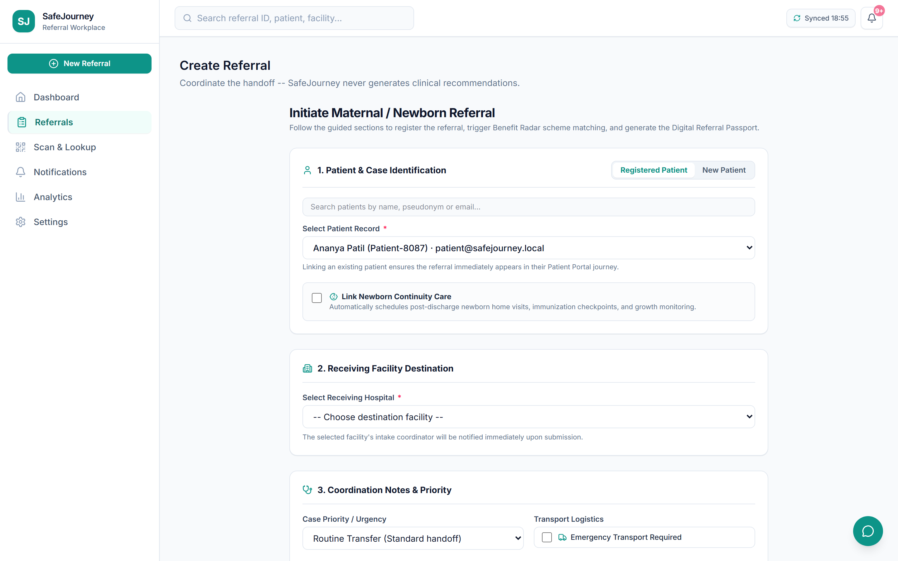
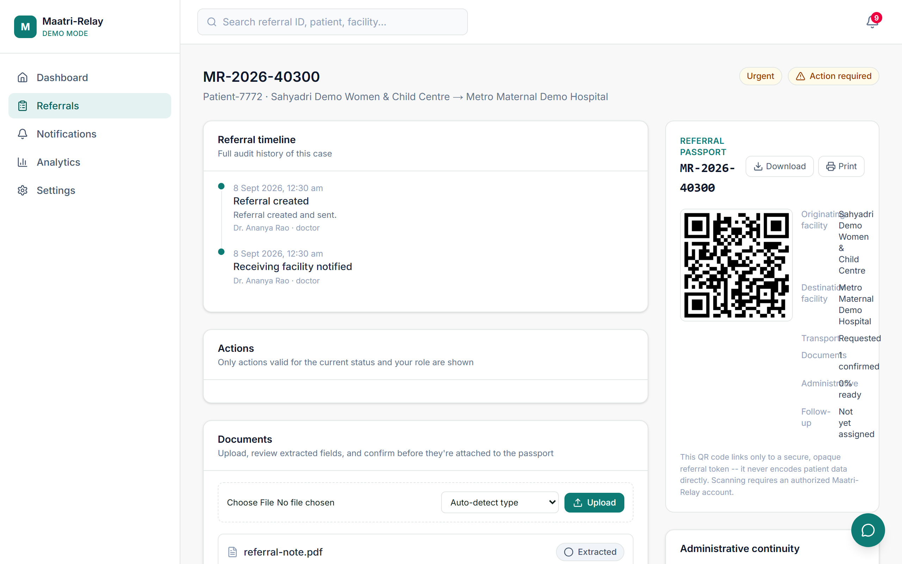
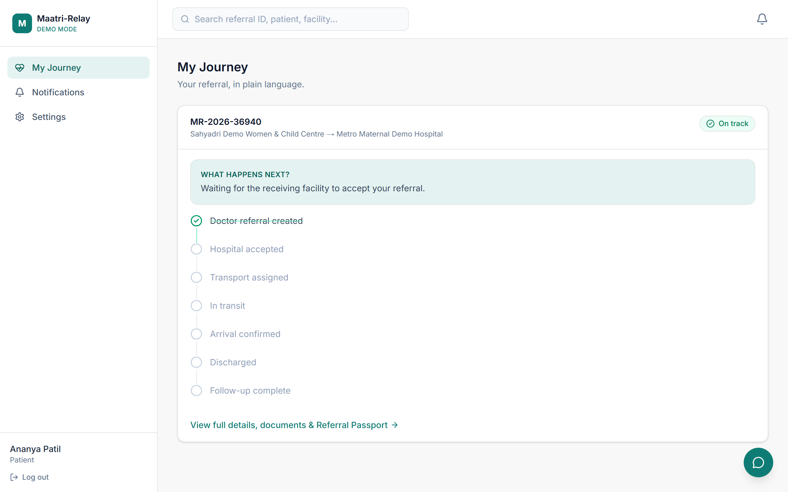
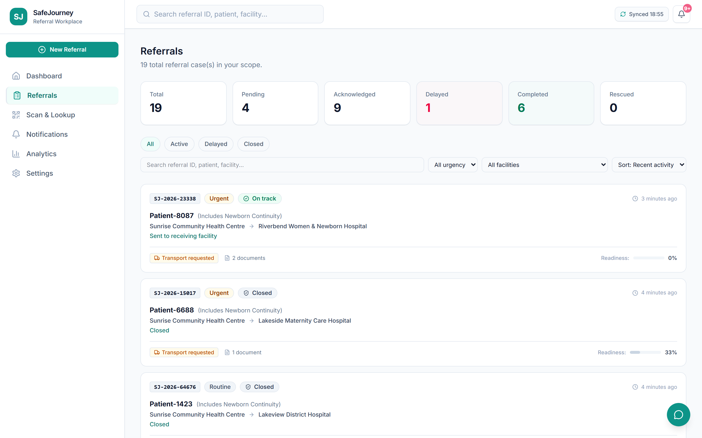
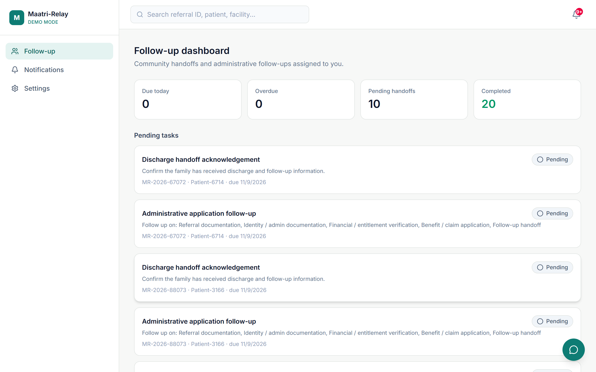
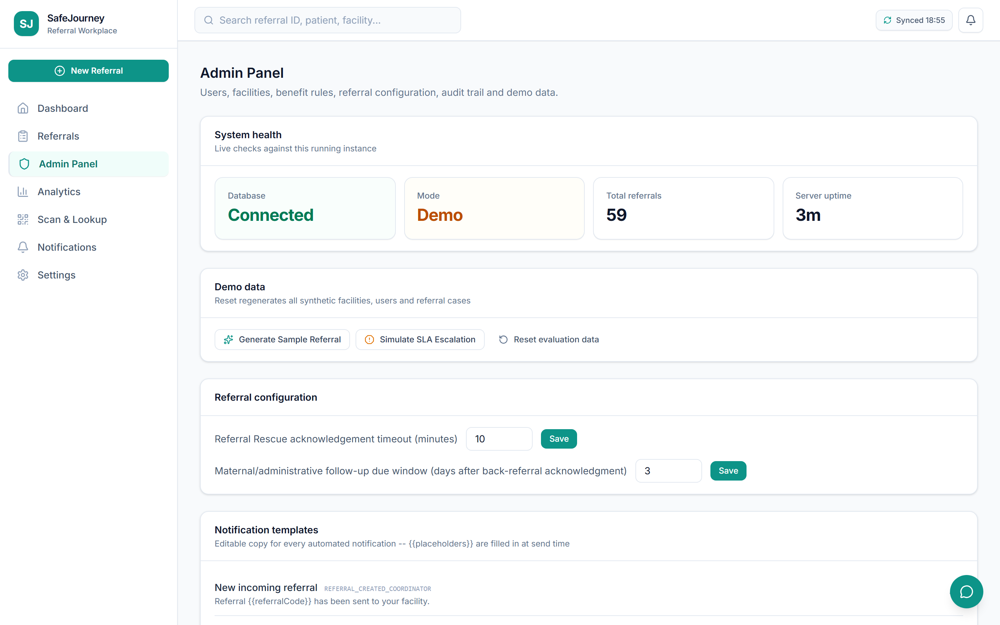

# SafeJourney (सुरक्षित यात्रा)

<div align="center">


### **Closed-Loop Maternal & Newborn Referral and Administrative Continuity Platform**
*Connecting referring facilities, receiving hospitals, emergency transport, document verification, welfare scheme entitlements, and post-discharge community follow-up while keeping clinical decisions with qualified healthcare professionals.*

[](https://safejourney-w7dz.onrender.com)
[](https://www.youtube.com/watch?v=P65yNU_TLf8)
[](https://nextjs.org/)
[](https://www.typescriptlang.org/)
[](https://tailwindcss.com/)
[](https://www.prisma.io/)
[](https://vitest.dev/)
[](https://playwright.dev/)
[](https://www.docker.com/)
[](LICENSE)

> *"Don't let a maternal or newborn referral end with a piece of paper."*

</div>

---

## 🚀 Live Demo

- **Deployed Application**: [https://safejourney-w7dz.onrender.com](https://safejourney-w7dz.onrender.com)
- **Instant Demo Switcher**: Pre-configured with 1-click role logins for Doctor (PHC), Intake Coordinator (District Hospital), Follow-up Worker (ASHA), Patient, and District Administrator.

---

## 🎥 Demo Video

- **YouTube Walkthrough**: [https://www.youtube.com/watch?v=P65yNU_TLf8](https://www.youtube.com/watch?v=P65yNU_TLf8)
- Complete demonstration covering referral creation, QR passport generation, intake triage, emergency transport coordination, welfare benefit discovery, discharge back-referral, and ASHA post-discharge milestone completion.

---

## 📌 Overview

**SafeJourney** is an assistive, non-clinical digital coordination platform designed to eliminate administrative dead ends in maternal and newborn referrals. Across rural and semi-urban health corridors, obstetric and neonatal emergencies often require rapid escalation from primary/community health centers to tertiary hospitals.

SafeJourney creates an unbroken digital coordination layer around the existing healthcare ecosystem: from the referring physician's initial transfer decision, through receiving facility acknowledgment, emergency transport tracking, diagnostic document verification, government welfare scheme discovery (JSSK, PMMVY, PM-JAY), to inpatient arrival, discharge summary generation, structured back-referral, and ASHA community follow-up.

---

## 🎯 Problem Statement

Every year, high-risk obstetric and neonatal emergencies are referred across healthcare facilities. However, critical gaps in operational handoffs cause preventable delays and complications:

1. **Unacknowledged Handoffs**: Patients arrive at receiving hospitals without advance digital notice or confirmed bed/specialist availability.
2. **Lost Paperwork & Identity Friction**: Physical referral slips, lab reports, and ultrasounds are easily lost or damaged in transit.
3. **Uncoordinated Transport**: Families struggle to arrange and track emergency ambulances between facilities.
4. **Missed Social Welfare Entitlements**: High-stress transfers lead to missed government entitlements (JSSK zero-expense benefits, PMMVY maternity benefits, PM-JAY coverage).
5. **Disconnected Post-Discharge Care**: After hospital discharge, patients return home with no structured back-referral to their local primary clinic or ASHA worker, leading to unmonitored postpartum complications.

---

## 💡 Solution

SafeJourney provides an end-to-end coordination platform grounded in a single foundational principle:

> **"AI explains. Rules verify. Humans decide."**

- **Closed-Loop Referral Lifecycle**: Every transfer follows a deterministic, verifiable state machine from creation to final case closure.
- **Opaque QR Referral Passport**: A lightweight, offline-scannable QR code that serves as a secure lookup token without storing raw patient PII in the code itself.
- **Referral Rescue Engine**: Automated SLA monitoring that flags unacknowledged referrals as `STUCK` and prompts immediate operational rerouting.
- **Deterministic Benefit Radar**: Pure rule-engine evaluation against national and state maternal welfare policies (JSSK, PMMVY, PM-JAY) with cited policy sources.
- **Full-Cycle Back-Referral & ASHA Follow-Up**: Closes the loop after hospital discharge by generating structured back-referrals and tracking home visit milestones.

---

## ✨ Key Features

- **Doctor Command Center**: Rapid structured referral creation with pre-filled clinical reasons, facility selection, and caregiver contact capture.
- **Coordinator Triage Inbox**: Intake dashboard for receiving hospital staff to accept, request clarification, or decline referrals with real-time capacity feedback.
- **Opaque QR Referral Passport & Camera Scanner**: Fast camera-based QR intake triage linking physical paper tokens to secure digital records.
- **Emergency Transport Logistics**: Track ambulance lifecycle stages (`REQUESTED` → `ASSIGNED` → `IN_TRANSIT` → `ARRIVED`).
- **Administrative Completeness Score**: Live readiness indicators tracking clinical documentation, identity verification, financial entitlements, and discharge planning.
- **Deterministic Benefit Radar**: Rule-based matching against JSSK, PMMVY, and PM-JAY criteria with required document checklists and policy citations.
- **Referral Rescue Engine**: Deterministic timeout detection that surfaces at-risk referrals exceeding SLA thresholds for prompt operational intervention.
- **Document Vault & AI-Assisted OCR**: Upload and preview PDF/image medical documents with human-confirmed structured data extraction.
- **Structured Discharge & Back-Referral Loop**: Record discharge outcomes and issue structured back-referrals requiring origin facility acknowledgment.
- **Newborn Continuity & Milestone Schedule**: Automatic generation of post-discharge home visits, immunization reminders, and growth checks.
- **Multilingual Patient Portal**: English, Hindi (हिंदी), and Marathi (मराठी) support with plain-language status explanations.
- **Administrative Governance & Audit Log**: Immutable audit trail recording actor, role, timestamp, old state, and new state for every action.
- **Operational Analytics Dashboard**: Real-time calculation of Closed-Loop Referral Rate, median handoff time, and corridor bottleneck metrics.

---

## 🔄 How It Works

```text
[PHC / CHC Doctor]
       │
       ▼ (Creates Referral + Generates QR Passport)
[SENT / PENDING ACKNOWLEDGMENT] ─────────────► [Referral Rescue Engine]
       │                                       (Flags STUCK if SLA breaches)
       ▼
[Receiving Facility Coordinator]
       │ (Accepts / Clarifies / Declines)
       ▼
[ACKNOWLEDGED] ──► [Transport Logistics] ──► [IN_TRANSIT] ──► [ARRIVED]
       │
       ▼ (Under Inpatient Care)
[DISCHARGED] (Destination + Summary recorded)
       │
       ▼ (Sends Structured Back-Referral)
[BACK_REFERRED]
       │
       ▼ (Origin Facility Acknowledges Receipt & Assigns Worker)
[FOLLOW_UP_PENDING] (ASHA home visits, immunization reminders, growth checks)
       │
       ▼ (All milestones completed or explicitly skipped with reason)
[CLOSED] (Immutable Case Record)
```

---

## 🏗️ System Architecture

SafeJourney is architected as a modular, unified full-stack application with strict separation between pure logic, database persistence, and user interfaces:

```text
┌────────────────────────────────────────────────────────────────────────┐
│                      Client Layer (Browser / Mobile)                   │
│   React Server Components (RSC)  +  Interactive Client UI (Tailwind)    │
└───────────────────────────────────┬────────────────────────────────────┘
                                    │ HTTP / JSON
┌───────────────────────────────────▼────────────────────────────────────┐
│                    Next.js 14 App Router API Layer                     │
│    Auth Middleware (JWT httpOnly) ──► Zod Validation ──► RBAC Gate    │
└───────────────────────────────────┬────────────────────────────────────┘
                                    │ Typed Service Calls
┌───────────────────────────────────▼────────────────────────────────────┐
│                      Core Pure Business Logic Engines                  │
│  ┌──────────────────────┐ ┌──────────────────────┐ ┌────────────────┐  │
│  │ State Machine Engine │ │ Referral Rescue Eng. │ │ Benefit Radar  │  │
│  │ (Forward Graph Move) │ │ (SLA Wall-Clock Calc)│ │ (Deterministic)│  │
│  └──────────────────────┘ └──────────────────────┘ └────────────────┘  │
└───────────────────────────────────┬────────────────────────────────────┘
                                    │ Safe Service Facade
┌───────────────────────────────────▼────────────────────────────────────┐
│                  Service Layer & Provider Abstractions                 │
│   referralService │ storageService (Local/S3) │ aiService (Demo/Live)  │
└───────────────────────────────────┬────────────────────────────────────┘
                                    │ Prisma ORM
┌───────────────────────────────────▼────────────────────────────────────┐
│                        Database & Storage Layer                        │
│          SQLite (Zero-Config Demo) / PostgreSQL (Production)           │
│          Local Disk / AWS S3 / Cloudflare R2 Document Store            │
└────────────────────────────────────────────────────────────────────────┘
```

For detailed architectural documentation, see [docs/04_ARCHITECTURE.md](https://github.com/daanialmirza5/SafeJourney/tree/main/docs/04_ARCHITECTURE.md).

---

## 🛠️ Tech Stack

| Domain | Technologies |
|---|---|
| **Frontend** | [Next.js 14.2](https://nextjs.org/) (App Router, Server Components), [React 18](https://react.dev/), [Tailwind CSS v4](https://tailwindcss.com/), [Lucide React](https://lucide.dev/), [Recharts 3.10](https://recharts.org/) |
| **Backend** | Next.js API Route Handlers (Node.js runtime), [Zod 4.5](https://zod.dev/) payload validation, [bcryptjs](https://www.npmjs.com/package/bcryptjs), [jsonwebtoken](https://www.npmjs.com/package/jsonwebtoken) |
| **Database & ORM** | [Prisma 5.22](https://www.prisma.io/), SQLite (Zero-config local development and demo), PostgreSQL-ready |
| **AI / OCR** | Provider abstraction layer supporting offline deterministic assistant and OCR document extraction with strict clinical safety guardrails (`isClinicalQuestion()`) |
| **APIs & Services** | [qrcode](https://www.npmjs.com/package/qrcode) (Opaque token generation), Storage Service (Local disk / AWS S3 / Cloudflare R2 adapter), In-App Notification Service |
| **Deployment** | [Render](https://render.com/) Web Service, Docker, Docker Compose |
| **Testing & Quality** | [Vitest 1.6](https://vitest.dev/) (172 unit & integration tests), [Playwright 1.63](https://playwright.dev/) (E2E testing), [TypeScript 5.9](https://www.typescriptlang.org/) (Strict), [ESLint](https://eslint.org/) |

---

## 📸 Application Screenshots

### 1. Landing Portal & Value Proposition
<div align="center">


</div>

---

### 2. 1-Click Role Switcher & Authentication
<div align="center">


</div>

---

### 3. Doctor Command Center & Referral Creation
| Doctor Dashboard | Structured Referral Creation Form |
|:---:|:---:|
|  |  |

---

### 4. Digital Referral Passport & Scheme Benefit Radar
<div align="center">



</div>

---

### 5. Receiving Facility Intake Triage & Patient Journey
| Coordinator Triage & Transport Hub | Patient Live Journey & Multilingual Portal |
|:---:|:---:|
|  |  |

---

### 6. Referral Rescue Engine & SLA Escalations
<div align="center">



</div>

---

### 7. Post-Discharge Follow-Up & Administrative Governance
| ASHA Community Milestone Dashboard | Administrative Governance & Audit Trail |
|:---:|:---:|
|  |  |

---

### 8. Operational Analytics Dashboard
<div align="center">


</div>

---

## 📂 Project Structure

```text
SafeJourney/
├── src/
│   ├── app/                      # Next.js App Router routes and API handlers
│   │   ├── (app)/                # Authenticated application views
│   │   │   ├── admin/            # System administration & governance
│   │   │   ├── analytics/        # Performance KPIs & corridor bottlenecks
│   │   │   ├── dashboard/        # Role-customized command centers
│   │   │   ├── referrals/        # Referral creation, tracking & details
│   │   │   ├── scan/             # QR Referral Passport camera scanner
│   │   │   └── settings/         # Facility & profile settings
│   │   ├── api/                  # 40+ REST API Route Handlers
│   │   ├── login/                # Quick-login role switcher & auth
│   │   ├── layout.tsx            # Root layout & design tokens
│   │   └── page.tsx              # Public landing portal
│   ├── components/               # Modular React UI components
│   │   ├── admin/                # Admin panels, templates, rules
│   │   ├── layout/               # Header, navigation, role banner
│   │   ├── referral/             # Passport, actions, timeline, documents
│   │   └── ui/                   # Button, card, badge, modal primitives
│   └── lib/                      # Core business logic & services
│       ├── ai/                   # AI provider abstraction & safety filters
│       ├── benefits/             # Deterministic welfare scheme engine
│       ├── notifications/        # Notification service & templates
│       ├── referral/             # State machine, rescue engine, access rules
│       ├── storage/              # Local disk & S3 storage adapters
│       ├── auth.ts               # JWT & session verification
│       ├── db.ts                 # Prisma database client singleton
│       └── validation.ts         # Zod schemas for API payloads
├── prisma/
│   ├── schema.prisma             # Database schema definition
│   └── seed.ts                   # Realistic demo data seeder (55+ cases)
├── docs/                         # Comprehensive documentation suite (16 chapters)
│   ├── screenshots/              # High-resolution UI screenshots
│   ├── 01_PRODUCT_OVERVIEW.md    # Product scope & principles
│   ├── 04_ARCHITECTURE.md        # Deep-dive architecture specification
│   ├── 10_SECURITY_PRIVACY.md    # Security, consent, and audit specifications
│   ├── 13_DEMO_GUIDE.md          # Step-by-step evaluator demonstration guide
│   └── 15_LIMITATIONS.md         # Explicit safety & system boundaries
├── e2e/                          # Playwright end-to-end test suites
├── Dockerfile                    # Production container specification
├── docker-compose.yml            # Single-command Docker Compose orchestration
└── package.json                  # Dependencies & execution scripts
```

---

## 📚 Documentation

The repository includes a comprehensive 16-chapter technical documentation suite in the [`docs/`](https://github.com/daanialmirza5/SafeJourney/tree/main/docs) directory:

| Chapter | Topic | Description |
|---|---|---|
| [01_PRODUCT_OVERVIEW.md](https://github.com/daanialmirza5/SafeJourney/tree/main/docs/01_PRODUCT_OVERVIEW.md) | Product Overview | Core promise, scope boundaries, and MVP capabilities |
| [02_PRD.md](https://github.com/daanialmirza5/SafeJourney/tree/main/docs/02_PRD.md) | PRD | Product Requirements Document and user stories |
| [03_TRD.md](https://github.com/daanialmirza5/SafeJourney/tree/main/docs/03_TRD.md) | TRD | Technical Requirements Document and system limits |
| [04_ARCHITECTURE.md](https://github.com/daanialmirza5/SafeJourney/tree/main/docs/04_ARCHITECTURE.md) | Architecture | Detailed system architecture and data flows |
| [05_USER_JOURNEYS.md](https://github.com/daanialmirza5/SafeJourney/tree/main/docs/05_USER_JOURNEYS.md) | User Journeys | Step-by-step role flows and interactions |
| [06_DATABASE_SCHEMA.md](https://github.com/daanialmirza5/SafeJourney/tree/main/docs/06_DATABASE_SCHEMA.md) | Database Schema | Entity relationship model and indexes |
| [07_API_SPECIFICATION.md](https://github.com/daanialmirza5/SafeJourney/tree/main/docs/07_API_SPECIFICATION.md) | API Specification | 40+ REST API endpoints and payload contracts |
| [08_AI_ARCHITECTURE.md](https://github.com/daanialmirza5/SafeJourney/tree/main/docs/08_AI_ARCHITECTURE.md) | AI Architecture | Assistant and OCR provider abstractions |
| [09_RULE_ENGINE.md](https://github.com/daanialmirza5/SafeJourney/tree/main/docs/09_RULE_ENGINE.md) | Rule Engine | Deterministic Benefit Radar rule specifications |
| [10_SECURITY_PRIVACY.md](https://github.com/daanialmirza5/SafeJourney/tree/main/docs/10_SECURITY_PRIVACY.md) | Security & Privacy | RBAC, encryption, consent, and audit logs |
| [11_TESTING_STRATEGY.md](https://github.com/daanialmirza5/SafeJourney/tree/main/docs/11_TESTING_STRATEGY.md) | Testing Strategy | Unit, integration, and E2E test documentation |
| [12_DEPLOYMENT.md](https://github.com/daanialmirza5/SafeJourney/tree/main/docs/12_DEPLOYMENT.md) | Deployment | Production deployment on Render and Docker |
| [13_DEMO_GUIDE.md](https://github.com/daanialmirza5/SafeJourney/tree/main/docs/13_DEMO_GUIDE.md) | Demo Guide | 5-minute judge walkthrough script |
| [14_PILOT_PLAN.md](https://github.com/daanialmirza5/SafeJourney/tree/main/docs/14_PILOT_PLAN.md) | Pilot Plan | 90-day phased district implementation plan |
| [15_LIMITATIONS.md](https://github.com/daanialmirza5/SafeJourney/tree/main/docs/15_LIMITATIONS.md) | Limitations | Explicit non-goals and simulated subsystems |
| [16_FUTURE_ROADMAP.md](https://github.com/daanialmirza5/SafeJourney/tree/main/docs/16_FUTURE_ROADMAP.md) | Future Roadmap | Post-pilot enhancements and national integrations |

---

## ☁️ Deployment

SafeJourney is deployed on [Render](https://render.com/) as a containerized web service.

- **Production URL**: [https://safejourney-w7dz.onrender.com](https://safejourney-w7dz.onrender.com)
- **Container Build**: Multi-stage `Dockerfile` with zero-config standalone production output.
- **Docker Compose**: Pre-configured `docker-compose.yml` for single-command containerized local execution.

---

## 🧪 Testing

SafeJourney has a verified, comprehensive automated testing suite:

```bash
# Static TypeScript validation (0 errors)
npm run typecheck

# Code style and lint validation (0 warnings or errors)
npm run lint

# Run all 172 Vitest unit and integration tests (16 test files, 100% passing)
npm run test

# Run Playwright E2E smoke tests
npm run test:e2e:smoke
```

### Verified Test Suites:
- `src/lib/referral/stateMachine.test.ts` (20 tests) — Deterministic forward transitions, invalid move rejections, lateral overrides.
- `src/lib/referral/newbornContinuity.test.ts` (34 tests) — Linked mother-newborn cases and milestone scheduling.
- `src/lib/analytics/kpi.test.ts` (16 tests) — Closed-loop referral rate and SLA median time calculations.
- `src/lib/referral/rescueEngine.test.ts` (9 tests) — SLA timeout detection and status promotion.
- `src/lib/referral/listView.test.ts` (12 tests) — Scoped list query generation and role filters.
- `src/lib/referral/access.test.ts` (11 tests) — Server-side RBAC and data isolation rules.
- `src/lib/referral/closureSafeguards.test.ts` (6 tests) — Automatic case closure conditions.
- `src/lib/validation.test.ts` (16 tests) — Zod payload schemas.
- `src/lib/storage/storageService.test.ts` (9 tests) — Provider abstraction and graceful local disk fallback.
- `src/lib/benefits/ruleEngine.test.ts` (8 tests) — Deterministic JSSK, PMMVY, and PM-JAY matching.
- `src/lib/referral/adminCompleteness.test.ts` (7 tests) — Readiness score calculations.
- `src/lib/notifications/templates.test.ts` (6 tests) — Notification formatting across channels.
- `src/lib/ai/safety.test.ts` (2 tests) — Clinical question blocker enforcement.
- `src/lib/format.test.ts` (7 tests) — Display formatting.
- `src/lib/rateLimit.test.ts` (4 tests) — Rate limiting algorithms.
- `src/lib/i18n/translate.test.ts` (5 tests) — Multilingual key lookups.

---

## 🔐 Security / Privacy

- **Password Security**: Passwords hashed with `bcryptjs` (10 rounds).
- **Session Security**: JWT stored in `httpOnly`, `SameSite=Lax` cookies (with `Secure` in production) preventing XSS token theft.
- **Server-Side Authorization**: Every API mutation route enforces strict role-based gating (`requireRole()`) and record-level scoping (`canAccessReferral()`).
- **Opaque Tokenization**: QR Referral Passports contain random opaque UUID tokens; no unencrypted patient PII is stored inside QR codes.
- **Document Security**: Strict MIME-type filtering, file size limits (10 MB cap), randomized UUID disk keys, and scoped access checks on all document routes.
- **Consent Architecture**: Scoped, revocable caregiver and health worker access with audit records.
- **Immutable Audit Trail**: Centralized audit logging capturing actor, role, timestamp, old state, and new state for all operations.
- **Clinical Safety Fence**: The AI assistant strictly blocks diagnostic and clinical advice queries using `isClinicalQuestion()`.

---

## 🚀 Getting Started

### Prerequisites
- **Node.js**: v20.x or higher LTS
- **npm**: v10.x or higher
- **Git**: Installed and configured

### Step-by-Step Installation

```bash
# 1. Clone the repository
git clone https://github.com/daanialmirza5/SafeJourney.git
cd SafeJourney

# 2. Install dependencies
npm install

# 3. Setup environment configuration
cp .env.example .env.local

# 4. Generate Prisma Client and initialize database
npx prisma generate
npm run db:seed

# 5. Start the local development server
npm run dev
```

Open [http://localhost:3000](http://localhost:3000) in your browser.

---

## 🔮 Future Scope

- **ABDM Integration**: Ayushman Bharat Digital Mission (M1/M2/M3) integration for longitudinal health records.
- **FHIR / HL7 Bundles**: Export standardized FHIR referral bundles for inter-hospital EHR interoperability.
- **Mobile PWA Offline Sync**: Service-worker caching for low-connectivity rural ASHA home visits.
- **Live SMS/WhatsApp Gateway**: Production integration with national telecom gateways for direct SMS notifications.

---


## 📄 License

This project is licensed under the **MIT License** — see the [LICENSE](LICENSE) file for details.
